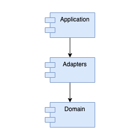

<h1 align="center">
  <a href="https://github.com/alonsomatias17">
  </a>
  <br>
  <br>
  Cinema Service
  <br>
</h1>
<h4 align="center">Cinema app build with Kotlin, Ktor and Koin.</h4>

#### Package Architecture

Based on hexagonal architecture



As it can be seen, the <strong>Application</strong> module has visibility over Adapters and Domain.
<strong>Adapters</strong> module has visibility over Domain.
And the last one <strong>Domain</strong> can't "see" any other module but itself. Thus, Domain module can only interact with Adapters module over ports(interfaces).

### Dependencies

- Docker for storage (dynamodb) usage
- [OMDb API access](http://www.omdbapi.com/)
  
### Running the project

Before running the project please ensure that all the dependencies are installed in your system. Then follow the next:

1. First run, to star-up the storage (docker is needed)

    ```
    docker-compose up
    ```

2. Then you can run the app locally (you need to provide valid OMDb key)

    ```
    imdbKey={yourKey} gradle run
    ```

### Running quality checks

This project includes a static code analysis tool for the Kotlin programming language:

```
./gradlew detekt
```

### Running the tests

In order to run the project tests you need to execute the following command:

```
gradle test
```

##Documentation

The application must be running to use this doc

* [SwaggerUI](http://localhost:8080/swagger-ui/index.html?url=/docs/openapi.json#/)
* [ReDoc](http://localhost:8080/docs/redoc)